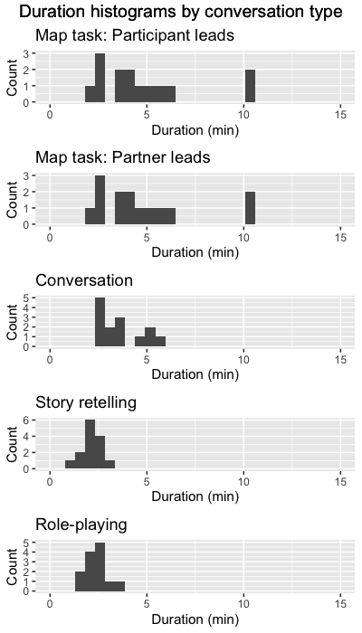

This R markdown provides the data preparation for our project analyzing how 
power and politeness affect interpersonal movement synchrony during a variety 
of interaction tasks (Paxton, Brown, & Winter, *in preparation*). 

To run this from scratch, you will need the following files:

* `./data/movement_dataframes-aggregated/`: Directory of movement data 
  derived from videos (30 FPS) using a frame-differencing method (e.g., Paxton 
  & Dale, 2013, *Behavior Research Methods*). De-identified movement data are 
  freely available in the OSF repository for the project: `https://osf.io/wrzf2/`.
* `./scripts/03-data_analysis/required_packages-pac.r`: Installs required libraries, 
  if they are not already installed. **NOTE**: This should be run *before* running 
  this script.
* `./scripts/03-data_analysis/libraries_and_functions-pac.r`: Loads in necessary 
  libraries and creates new functions for our analyses.

Additional files will be created during the initial run that will help reduce processing 
time. Many of these are available as CSVs from the OSF repository listed above.

**Code written by**: A. Paxton (University of California, Berkeley)

**Date last modified**: 25 July 2018

***

# Data import

**NOTE**: The chunks of code in this section do not have to be run each time, 
since the resulting datasets will be saved to CSV files. As a result, these 
chunks are currently set to `eval=FALSE`. Bear this in mind if these data 
need to be re-calculated.

***

## Preliminaries

This section clears the workspace, loads (and, if needed, installs) required 
packages, and specifies important global variables.


```r
# clear our workspace
rm(list=ls())

# # if needed, uncomment this to install libraries
# source('./scripts/03-data_analysis/required_packages-pac.r')

# read in libraries and create functions
source('./scripts/03-data_analysis/libraries_and_functions-pac.r')
```

***

## Pre-process and concatenate movement data

After initial video processing, each video clip produced its own file of movement
data. Here, we first pre-process the data by downsampling to 10Hz (consistent with previous
research on movement coordination; cf. Paxton & Dale, 2013, *Behavior Research Methods*).
We then remove first few seconds and last few seconds of the data from each conversation
and concatenate all conversations' movement data into a single file.


```r
# get list of individual conversations included in the data
conversation_files = list.files('./data/movement_dataframes-aggregated',
                                full.names = TRUE)

# specify Butterworth filters
anti_aliasing_butter = signal::butter(4,.4)
post_downsample_butter = signal::butter(2,.02)

# process each file
conversation_df = data.frame()
for (conversation_file in conversation_files){
  
  # read info from the next conversation file
  next_conversation = read.table(conversation_file, sep=',',
                           header=TRUE, stringsAsFactors = FALSE) %>%
    
    # derive condition information from filename
    separate(dyad, into = c('participant_id',
                            'participant_gender',
                            'partner_type',
                            'task',
                            'condition'), sep='_') %>%
    
    # remove .mov extension from condition
    mutate(condition = sub(pattern = "(.*?)\\..*$", replacement = "\\1", condition)) %>%
    
    # delineate movement between target participant (1 / L) and partner (0 / R)
    mutate(participant = ifelse(participant=='left',
                                1,
                                0)) %>%
    
    # create a time variable from the difference number
    mutate(t = difference_number / raw_sampling_rate) %>%
    
    # filter and downsample
    group_by(participant) %>%
    mutate(movement = signal::filtfilt(anti_aliasing_butter, movement)) %>%
    mutate(t = floor(t * downsampled_sampling_rate) / downsampled_sampling_rate) %>%
    ungroup() %>%
    group_by(participant, t) %>%
    mutate(movement = mean(movement)) %>%
    slice(1) %>%
    ungroup() %>%
    group_by(participant) %>%
    mutate(movement = signal::filtfilt(post_downsample_butter, movement)) %>%
    ungroup() %>%
  
    # drop unneeded variable and rename participant
    select(-difference_number) %>%
    rename(interlocutor = participant) %>% 
    
    # trim the beginning and end from each conversation (instructions and wrap-up time)
    group_by(participant_id, interlocutor) %>%
    slice(-c(1:(trimmed_time * downsampled_sampling_rate))) %>%
    arrange(desc(t)) %>%
    slice(-c(1:(trimmed_time * downsampled_sampling_rate))) %>%
    arrange(t) %>%
    ungroup()
  
  # save plot of movement with beginning and end trimmed
  trimmed_movement_plot = ggplot(next_conversation,
                             aes(x = t,
                                 y = movement,
                                 color = as.factor(interlocutor))) +
    geom_line() +
    geom_path()
  ggsave(plot = trimmed_movement_plot,
         height = 3,
         width = 3,
         filename = paste0('./figures/movement-trimmed/pac-trimmed_movement-',
                           basename(conversation_file),'.jpg'))
  
  # append dataframe to group files
  conversation_df = rbind.data.frame(conversation_df, 
                                     next_conversation)
}

# save aggregated file
write.table(conversation_df,
            './data/pac-filtered_movement_data.csv',
            sep = ",", append = FALSE, row.names = FALSE, col.names = TRUE)
```

## Summarize conversation information

Now that we've prepared the data for recurrence analyses, let's find 
out a bit more about the conversations.


```r
summary_stats = conversation_df %>% ungroup() %>%
  group_by(participant_id, task) %>%
  summarise(duration = max(t)) %>%
  mutate(num_samples = duration * downsampled_sampling_rate) %>%
  mutate(max_time = round(duration / 60, 2)) %>%
  ungroup()
```


```r
# what's the range of conversation data (in minutes) by conversation type?
summary_duration = summary_stats %>% ungroup() %>%
  group_by(task) %>%
  summarise(min_duration = min(max_time),
            max_duration = max(max_time),
            mean_duration = mean(max_time))
print(summary_duration)
```

```
## # A tibble: 4 x 4
##   task   min_duration max_duration mean_duration
##   <fct>         <dbl>        <dbl>         <dbl>
## 1 Convo          2.47         5.55          3.62
## 2 Map            4.53        12.3           8.50
## 3 Role           1.39         3.68          2.44
## 4 Tweety         1.14         3.01          2.10
```




***

# Recurrence analyses

**NOTE**: The chunks of code in this section do not have to be run each time, 
since the resulting datasets will be saved to CSV files. As a result, these 
chunks are currently set to `eval=FALSE`. Bear this in mind if these data need 
to be re-calculated.

***

## Preliminaries

This section clears the workspace and reads in the prepared data files.


```r
# clear our workspace
rm(list=ls())

# read in libraries and functions again
source('./scripts/03-data_analysis/libraries_and_functions-pac.r')

# read in data
conversation_df = read.table('./data/pac-filtered_movement_data.csv',
                            sep=',',header=TRUE) 
```

***

## Identify CRQA parameters

Before we can analyze the data, we need to identify the appropriate parameters 
for continuous CRQA for the dataset. We identify parameters that provide a 
steady *rate of recurrence* or *RR* of 5% for each conversation and save 
these parameters to a CSV file.

The source file produces outputs that are useful for tracking progress, 
but we suppress them here for brevity.


***

## Prepare for CRQA and DRPs


```r
# read in our crqa parameters
conversation_df_crqa = read.table('./data/crqa_data_and_parameters-pac.csv',
                         sep=',',header=TRUE) %>%
  select(-rr, -from.target, -movement_0, -movement_1)
  
# grab other information from the original df
supplemental_info = conversation_df %>% ungroup() %>%
  select(participant_id, partner_type, task, participant_gender, condition) %>%
  distinct() %>%
  
  # convert to partner type to numeric
  mutate(partner_type_str = partner_type) %>%
  mutate(partner_type = ifelse(partner_type=='Friend',
                               0,      # friend = 0
                               1)) %>% # prof = 1
  
  # convert to gender to numeric
  mutate(participant_gender_str = participant_gender) %>%
  mutate(participant_gender = ifelse(participant_gender=='F',
                                     0,      # female = 0
                                     1)) %>% # male = 1
  
  # convert to condition to numeric
  mutate(condition_str = condition) %>%
  mutate(condition = ifelse(condition=='AB',
                            0,      # AB = 0
                            1)) %>% # BA = 1
  
  # convert to task to numeric
  mutate(task_str = task) %>%
  mutate(task = ifelse(task=='Convo',
                       1,                  # Convo = 1
                       ifelse(task=='Map',
                              2,           # Map = 2
                              ifelse(task=='Role',
                                     3,    # Role = 3
                                     4)))) # Tweety = 4

# combine both
conversation_df_crqa = full_join(supplemental_info,
                                  conversation_df_crqa,
                                 by = c("participant_id",
                                        "task_str"="task",
                                        "partner_type_str"="partner_type"))
```

***

## Run CRQA and DRPs

Now that we have our parameters, we run continuous CRQA over each conversation for each dyad using the `crqa` function from the `crqa` package (Coco & Dale, 2014, *Frontiers in Psychology*).


```r
# identify window size
target_seconds = 5
win_size = target_seconds * downsampled_sampling_rate

# slice up the data so that we have one dataset per conversation
split_convs = split(conversation_df_crqa,
                    list(conversation_df_crqa$participant_id, 
                         conversation_df_crqa$partner_type,
                         conversation_df_crqa$task))

# cycle through each conversation using the sliced subsets
drp_results = data.frame()
crqa_results = data.frame()
for (next_conv in split_convs){
  if (dim(next_conv)[1] > 0){
    
    # isolate parameters for this next dyad
    chosen.delay = unique(next_conv$chosen.delay)
    chosen.embed = unique(next_conv$chosen.embed)
    chosen.radius = unique(next_conv$chosen.radius)
    
    # get basic info
    participant_id = unique(next_conv$participant_id)
    partner_type = unique(next_conv$partner_type)
    partner_type_str = unique(next_conv$partner_type_str)
    task = unique(next_conv$task)
    task_str = unique(next_conv$task_str)
    
    # print update
    print(paste0("CRQA: Participant ", participant_id,
                ", partner ", partner_type_str,
                ", task ", task_str))
    
    # run cross-recurrence
    # order time series so that they reflect actual seating in experiment
    rec_analysis = crqa(ts1=next_conv$rescale.movement_1, # participant
                        ts2=next_conv$rescale.movement_0, # partner
                        delay=chosen.delay,
                        embed=chosen.embed,
                        r=chosen.radius,
                        normalize=0, 
                        rescale=0, 
                        mindiagline=2,
                        minvertline=2, 
                        tw=0, 
                        whiteline=FALSE,
                        recpt=FALSE)
    
    # save plot-level information to dataframe
    next_data_line = data.frame(c(participant_id,
                                  partner_type,
                                  task,
                                  rec_analysis[1:9]))
    names(next_data_line) = c("participant_id", 'partner_type', 'task',
                              names(rec_analysis[1:9]))
    crqa_results = rbind.data.frame(crqa_results,next_data_line)
  
    # recreate DRP from diagonal lines within our target window
    diag_lines = spdiags(rec_analysis$RP)
    subset_plot = data.frame(diag_lines$B[,diag_lines$d >= -win_size & diag_lines$d <= win_size])
    rr = colSums(subset_plot)/dim(subset_plot)[1]
  
    # convert to dataframe, padding (with 0) where no RR was observed
    next_drp = dplyr::full_join(data.frame(lag = as.integer(stringr::str_replace(names(rr),'X',''))-(win_size+1),
                                           rr = rr),
                         data.frame(lag = -win_size:win_size),
                         by='lag')
    next_drp[is.na(next_drp)] = 0
  
    # save it to dataframe
    next_drp$participant_id = participant_id
    next_drp$partner_type = partner_type
    next_drp$task = task
    drp_results = rbind.data.frame(drp_results,next_drp)
}}

# save results to file
write.table(crqa_results,'./data/crqa_results-pac.csv',sep=",")
write.table(drp_results,'./data/drp_results-pac.csv',sep=',')
```

***

## Export merged recurrence dataset


```r
# merge CRQA and DRP analysis results
recurrence_results = full_join(drp_results, crqa_results,
                               by=c("participant_id", 'partner_type', 'task'))

# merge recurrence analyses and condition information
recurrence_df = full_join(recurrence_results, supplemental_info,
                          by=c("participant_id", 'partner_type', 'task'))

# save to file
write.table(recurrence_df,'./data/recurrence_df-pac.csv',sep=',')
```

***

# Data preparation

Now that we've calculated our CRQA and DRP measures, we're ready to prepare our data for analysis.

**NOTE**: The chunks of code in this section do not have to be run each time, 
since the resulting datasets will be saved to CSV files. As a result, these chunks 
are currently set to `eval=FALSE`. Bear this in mind if these data need to be re-calculated.

***

## Preliminaries

This section clears the workspace and reads in the prepared data files.


```r
# clear our workspace
rm(list=ls())

# read in libraries and create functions
source('./scripts/03-data_analysis/libraries_and_functions-pac.r')

# read in the recurrence dataframe
recurrence_df = read.table('./data/recurrence_df-pac.csv', sep=',', header=TRUE)
```

***

## Create first- and second-order polynomials

In order to examine the linear and curvilinear patterns in the DRPs (cf. 
Main, Paxton, & Dale, 2016, *Emotion*), we create orthogonal polynomials 
for the lag term. This section creates the first- and second-order 
othogonal polynomials that are essential to allowing us to interpret the 
linear (i.e., first-order polynomial) and quadratic (i.e., second-order 
polynomial) patterns in the DRP independently from one another.


```r
# create first- and second-order orthogonal polynomials for lag
raw_lag = min(recurrence_df$lag):max(recurrence_df$lag)
lag_vals = data.frame(raw_lag)
lag_offset = (0-min(raw_lag)) + 1
t = stats::poly((raw_lag + lag_offset), 2)
lag_vals[, paste("ot", 1:2, sep="")] = t[lag_vals$raw_lag + lag_offset, 1:2]

# join it to the original data table
recurrence_df = left_join(recurrence_df,lag_vals, by = c("lag" = "raw_lag"))
```

***
 
## Specify precision


```r
recurrence_df = recurrence_df %>% ungroup() %>%
  mutate_all(funs(sprintf("%.14f",.)))
```

***

## Export dataframe


```r
# export dataframe
dput(recurrence_df, './data/plotting_df-pac.csv')
```

***

# Data analysis

Our data are clean, our parameters are identified, and our dataframe
is ready to go. We now analyze our data and generate visualizations.

***

## Preliminaries

This section clears the workspace and reads in the prepared data files.


```r
# clear our workspace
rm(list=ls())

# read in libraries and create functions
source('./scripts/03-data_analysis/libraries_and_functions-pac.r')

# read in the plotting dataframe
rec_plot = dget('./data/plotting_df-pac.csv') %>% mutate_all(funs(as.numeric(.)))

# make sure we treat factors as factors
rec_plot = rec_plot %>% ungroup() %>%
  mutate_at(vars(one_of(factor_variables)),
            funs(as.factor))
```

***

## Recurrence by lag, partner type, and task

We now create a linear mixed-effects model to gauge how 
linear lag (`ot1`) and quadratic lag (`ot2`) interact with 
partner type (`partner_type`) and task (`task`) to 
influence overall body movement coordination (`rr`).


```r
# model
rr_partner_task_gca_raw = lmer(rr ~ ot1 * ot2 * partner_type * task + 
                                 (1 + ot1 + ot2 + partner_type + task | participant_id) +
                                 (1 + partner_type | condition),
                               data = rec_plot, REML = FALSE)

# readable output
pander_lme(rr_partner_task_gca_raw)
```


|                &nbsp;                 | Estimate  | Std..Error | t.value |   p    | sig |
|:-------------------------------------:|:---------:|:----------:|:-------:|:------:|:---:|
|            **(Intercept)**            |  0.06663  |  0.005785  |  11.52  | 0.0001 | *** |
|                **ot1**                | -0.07444  |  0.02138   | -3.482  |   0    | *** |
|                **ot2**                |  -0.2246  |   0.0217   | -10.35  | 0.0001 | *** |
|         **partner_type-0.5**          |  -0.0108  |  0.006993  | -1.545  | 0.122  |     |
|             **task-0.5**              |  0.02423  |  0.01336   |  1.814  |  0.07  |  .  |
|              **task0.5**              | -0.01391  |  0.01107   | -1.256  | 0.209  |     |
|              **task1.5**              | -0.008415 |  0.006954  |  -1.21  | 0.226  |     |
|              **ot1:ot2**              |  0.3117   |   0.143    |  2.181  | 0.029  |  *  |
|       **ot1:partner_type-0.5**        |  0.03873  |  0.01788   |  2.167  |  0.03  |  *  |
|       **ot2:partner_type-0.5**        |  0.1965   |  0.01252   |  15.69  | 0.0001 | *** |
|           **ot1:task-0.5**            |  0.1712   |  0.01913   |  8.948  | 0.0001 | *** |
|            **ot1:task0.5**            |  -0.1982  |  0.01788   | -11.09  | 0.0001 | *** |
|            **ot1:task1.5**            |  0.2193   |  0.01788   |  12.27  | 0.0001 | *** |
|           **ot2:task-0.5**            | -0.03929  |  0.01346   | -2.919  | 0.004  | **  |
|            **ot2:task0.5**            |  0.02769  |  0.01252   |  2.211  | 0.027  |  *  |
|            **ot2:task1.5**            | -0.02538  |  0.01252   | -2.026  | 0.043  |  *  |
|     **partner_type-0.5:task-0.5**     | -0.005165 |  0.001358  | -3.804  | 0.0001 | *** |
|     **partner_type-0.5:task0.5**      | 0.008038  |  0.001249  |  6.434  | 0.0001 | *** |
|     **partner_type-0.5:task1.5**      | 0.009939  |  0.001249  |  7.956  | 0.0001 | *** |
|     **ot1:ot2:partner_type-0.5**      |  -0.6067  |   0.2022   | -3.001  | 0.003  | **  |
|         **ot1:ot2:task-0.5**          |  -1.172   |   0.2155   | -5.437  | 0.0001 | *** |
|          **ot1:ot2:task0.5**          |   1.332   |   0.2022   |  6.588  | 0.0001 | *** |
|          **ot1:ot2:task1.5**          |  -1.695   |   0.2022   | -8.384  | 0.0001 | *** |
|   **ot1:partner_type-0.5:task-0.5**   |  -0.1055  |  0.02618   |  -4.03  | 0.0001 | *** |
|   **ot1:partner_type-0.5:task0.5**    |  0.2144   |  0.02528   |  8.48   | 0.0001 | *** |
|   **ot1:partner_type-0.5:task1.5**    |  -0.2889  |  0.02528   | -11.43  | 0.0001 | *** |
|   **ot2:partner_type-0.5:task-0.5**   |  0.04716  |  0.01839   |  2.565  |  0.01  |  *  |
|   **ot2:partner_type-0.5:task0.5**    |  0.01975  |  0.01771   |  1.115  |  0.26  |     |
|   **ot2:partner_type-0.5:task1.5**    |  0.03322  |  0.01771   |  1.876  | 0.061  |  .  |
| **ot1:ot2:partner_type-0.5:task-0.5** |   1.266   |   0.2955   |  4.283  | 0.0001 | *** |
| **ot1:ot2:partner_type-0.5:task0.5**  |  -1.331   |   0.2859   | -4.656  | 0.0001 | *** |
| **ot1:ot2:partner_type-0.5:task1.5**  |   2.188   |   0.2859   |  7.653  | 0.0001 | *** |

*** 

## Exploring interaction terms

In order to understand the higher-order interactions, we 
create separate datasets for the friend and professor 
conversations and then re-run the model as above.

### Create separate dataframes


```r
# create friend raw dataframe
friend_raw = rec_plot %>% ungroup() %>%
  mutate_all(funs(as.numeric)) %>%
  dplyr::filter(partner_type == min(partner_type))

# create professor raw dataframe
professor_raw = rec_plot %>% ungroup() %>%
  mutate_all(funs(as.numeric)) %>%
  dplyr::filter(partner_type == max(partner_type))

# convert to factors
friend_raw = friend_raw %>% ungroup() %>% 
  mutate_at(vars(one_of(factor_variables)), funs(as.factor))
professor_raw = professor_raw %>% ungroup() %>% 
  mutate_at(vars(one_of(factor_variables)), funs(as.factor))
```

### Friend-only model


```r
# friends: unstandardized (raw) model
rr_friend_task_gca_raw = lmer(rr ~ ot1 * ot2 * task + 
                                (1 + ot1 + ot2 + task | participant_id) +
                                (1 | condition),
                              data = friend_raw, REML = FALSE)
pander_lme(rr_friend_task_gca_raw)
```


|      &nbsp;       | Estimate  | Std..Error | t.value |   p    | sig |
|:-----------------:|:---------:|:----------:|:-------:|:------:|:---:|
|  **(Intercept)**  |  0.06663  |  0.007154  |  9.313  | 0.0001 | *** |
|      **ot1**      | -0.07444  |   0.0247   | -3.014  | 0.003  | **  |
|      **ot2**      |  -0.2246  |  0.04312   | -5.208  | 0.0001 | *** |
|     **task2**     |  0.02594  |  0.01766   |  1.469  | 0.142  |     |
|     **task3**     | -0.01391  |  0.01125   | -1.237  | 0.216  |     |
|     **task4**     | -0.008415 |  0.007923  | -1.062  |  0.29  |     |
|    **ot1:ot2**    |  0.3117   |   0.1345   |  2.317  |  0.02  |  *  |
|   **ot1:task2**   |  0.1704   |  0.01809   |  9.42   | 0.0001 | *** |
|   **ot1:task3**   |  -0.1982  |  0.01682   | -11.78  | 0.0001 | *** |
|   **ot1:task4**   |  0.2193   |  0.01682   |  13.04  | 0.0001 | *** |
|   **ot2:task2**   | -0.01445  |  0.01281   | -1.128  |  0.26  |     |
|   **ot2:task3**   |  0.02769  |  0.01178   |  2.35   | 0.019  |  *  |
|   **ot2:task4**   | -0.02538  |  0.01178   | -2.153  | 0.031  |  *  |
| **ot1:ot2:task2** |  -1.172   |   0.2028   | -5.779  | 0.0001 | *** |
| **ot1:ot2:task3** |   1.332   |   0.1902   |  7.001  | 0.0001 | *** |
| **ot1:ot2:task4** |  -1.695   |   0.1902   |  -8.91  | 0.0001 | *** |

### Professor-only model


```r
# professor: unstandardized (raw) model
rr_prof_task_gca_raw = lmer(rr ~ ot1 * ot2 * task +
                                (1 + ot1 + ot2 + task | participant_id) +
                                (1 | condition),
                              data = professor_raw, REML = FALSE)
pander_lme(rr_prof_task_gca_raw)
```


|      &nbsp;       | Estimate  | Std..Error | t.value  |   p    | sig |
|:-----------------:|:---------:|:----------:|:--------:|:------:|:---:|
|  **(Intercept)**  |  0.05582  |  0.009126  |  6.117   | 0.0001 | *** |
|      **ot1**      |  -0.0357  |  0.02607   |  -1.37   | 0.171  |     |
|      **ot2**      | -0.02808  |  0.02254   |  -1.246  | 0.213  |     |
|     **task2**     |  0.01906  |   0.0149   |  1.279   | 0.201  |     |
|     **task3**     | -0.005873 |  0.01615   | -0.3638  |  0.72  |     |
|     **task4**     | 0.001525  |   0.0103   |  0.148   |  0.88  |     |
|    **ot1:ot2**    |  -0.295   |  0.07427   |  -3.972  | 0.0001 | *** |
|   **ot1:task2**   |  0.06567  |  0.009287  |  7.072   | 0.0001 | *** |
|   **ot1:task3**   |  0.01619  |  0.009287  |  1.744   | 0.081  |  .  |
|   **ot1:task4**   | -0.06963  |  0.009287  |  -7.498  | 0.0001 | *** |
|   **ot2:task2**   | 0.007867  |  0.006506  |  1.209   | 0.227  |     |
|   **ot2:task3**   |  0.04745  |  0.006506  |  7.292   | 0.0001 | *** |
|   **ot2:task4**   | 0.007844  |  0.006506  |  1.206   | 0.228  |     |
| **ot1:ot2:task2** |  0.09376  |   0.105    |  0.8926  |  0.37  |     |
| **ot1:ot2:task3** | 0.000673  |   0.105    | 0.006408 |   1    |     |
| **ot1:ot2:task4** |  0.4932   |   0.105    |  4.696   | 0.0001 | *** |

***

# Discussion

***


