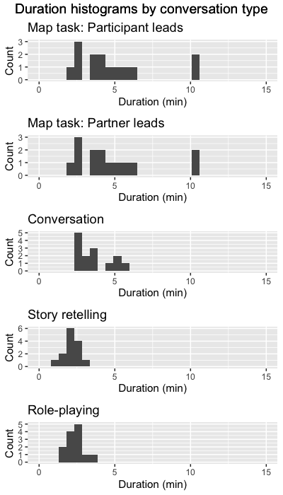

This R markdown provides the data preparation for our project analyzing how
power and politeness affect interpersonal movement synchrony during a variety of
interaction tasks (Paxton, Brown, & Winter, *in preparation*).

To run this from scratch, you will need the following files:

* `./data/movement_dataframes-aggregated/`: Directory of movement data derived
  from videos (30 FPS) using a frame-differencing method (e.g., Paxton & Dale,
  2013, *Behavior Research Methods*). De-identified movement data are freely
  available in the OSF repository for the project: `https://osf.io/wrzf2/`.
* `./scripts/03-data_analysis/required_packages-pac.r`: Installs required
  libraries, if they are not already installed. **NOTE**: This should be run
  *before* running this script.
* `./scripts/03-data_analysis/libraries_and_functions-pac.r`: Loads in necessary
  libraries and creates new functions for our analyses.

Additional files will be created during the initial run that will help reduce processing
time. Many of these are available as CSVs from the OSF repository listed above.

**Code written by**: A. Paxton (University of Connecticut)

**Date last modified**: 20 July 2019

***

# Data import

***

## Preliminaries

This section clears the workspace, loads required packages, and specifies
important global variables.

**Remember** to have run `./scripts/03-data_analysis/required_packages-pac.r`
locally *first*, to ensure that you have all necessary packages installed.

```{r prep-prelim, warning = FALSE, error = FALSE, message = FALSE}

# clear our workspace
rm(list=ls())

# turn on caching
knitr::opts_chunk$set(cache=TRUE, autodep=TRUE, cache.lazy=FALSE)

# set random seed, with options for parallelizations (later)
RNGkind("L'Ecuyer-CMRG")
set.seed(111)

# read in libraries and create functions
source('./scripts/03-data_analysis/libraries_and_functions-pac.r')

```

***

## Pre-process and concatenate movement data

After initial video processing, each video clip produced its own file of
movement data. Here, we first pre-process the data by downsampling to 10Hz
(consistent with previous research on movement coordination; cf. Paxton & Dale,
2013, *Behavior Research Methods*). We then remove the first and last few
seconds of the data from each conversation and concatenate all conversations'
movement data into a single file.

```{r preprocess-concatenate-data, warning = FALSE, error = FALSE, message = FALSE}

# get list of individual conversations included in the data
conversation_files = list.files('./data/movement_dataframes-aggregated',
                                full.names = TRUE)

# process each file
conversation_df = data.frame()
for (conversation_file in conversation_files){

  # read in next file
  next_conversation = read.table(conversation_file, sep=',',
                                 header=TRUE, stringsAsFactors = FALSE)

  # split info from dyad
  if (!grepl("Map", conversation_file)){
    next_conversation = next_conversation %>% ungroup() %>%
      separate(dyad, into = c('participant_id',
                              'participant_gender',
                              'partner_type',
                              'task',
                              'condition'), sep='_') %>%

      # remove .mov extension from condition
      mutate(condition = sub(pattern = "(.*?)\\..*$",
                             replacement = "\\1",
                             condition))  %>%

      # delineate movement between target participant (1 / L) and partner (0 / R)
      mutate(participant = ifelse(participant=='left',
                                  1,
                                  0))

  } else {
    next_conversation = next_conversation %>% ungroup() %>%
      separate(dyad, into = c('participant_id',
                              'participant_gender',
                              'partner_type',
                              'task',
                              'condition',
                              'map_cond'), sep='_') %>%

      # fix the task information to include who led (participant vs. interlocutor)
      unite(task, c('task','map_cond')) %>%
      mutate(task = sub(pattern = "(.*?)\\..*$",
                        replacement = "\\1",
                        task)) %>%

      # delineate movement between target participant (1 / L) and partner (0 / R)
      mutate(participant = ifelse(participant=='left',
                                  1,
                                  0))
  }

  # decimate movement
  conversations_split = split(next_conversation,
                              next_conversation$participant)
  decimated_df = data.frame()
  for (next_ts in conversations_split){

    # decimate the signal
    next_ts = dplyr::arrange(next_ts, difference_number)
    movement = signal::decimate(x = next_ts$movement, q = 3)

    # reconstitute the dataframe
    next_ts = data.frame(next_ts) %>% ungroup() %>%

      # grab only the top-line data we need and remove old movement variable
      slice(1) %>%
      select(-difference_number,
             -movement) %>%

      # add the decimated movement and create time variable
      cbind(., movement) %>%
      rownames_to_column(var="frame") %>%
      mutate(t = as.numeric(frame) / 10) %>%

      # trim the beginning and end (instructions and wrap-up time)
      dplyr::filter(t > trimmed_time,
                    t < (max(t) - trimmed_time)) %>%

      # rename participant
      dplyr::rename(interlocutor = participant)

    # add to shell
    decimated_df = rbind.data.frame(decimated_df,
                                    next_ts)
  }

  # save plot of movement with beginning and end trimmed
  trimmed_movement_plot = ggplot(decimated_df,
                                 aes(x = t,
                                     y = movement,
                                     color = as.factor(interlocutor))) +
    geom_line() +
    geom_path() +
    theme(legend.position="bottom")
  ggsave(plot = trimmed_movement_plot,
         height = 3,
         width = 3,
         filename = paste0('./figures/movement-trimmed/pac-trimmed_movement-',
                           basename(conversation_file),'.jpg'))

  # append dataframe to group files
  conversation_df = rbind.data.frame(conversation_df,
                                     decimated_df)
}

# save aggregated file
write.table(conversation_df,
            './data/pac-filtered_movement_data.csv',
            sep = ",", append = FALSE, row.names = FALSE, col.names = TRUE)

```

## Summarize conversation information

Now that we've prepared the data for recurrence analyses, let's find
out a bit more about the conversations.

```{r summarize-info}

summary_stats = conversation_df %>% ungroup() %>%
  dplyr::group_by(participant_id, task) %>%
  summarise(duration = max(t)) %>%
  mutate(num_samples = duration * downsampled_sampling_rate) %>%
  mutate(max_time = round(duration / 60, 2)) %>%
  ungroup()

```

```{r summary-range-duration}

# what's the range of conversation data (in minutes) by conversation type?
summary_duration = summary_stats %>% ungroup() %>%
  dplyr::group_by(task) %>%
  summarise(min_duration = min(max_time),
            max_duration = max(max_time),
            mean_duration = mean(max_time))
print(summary_duration)

```

```{r plot-conversation-summary-stats, echo=FALSE, warning = FALSE, error = FALSE, message = FALSE}

# separate by different tasks
map_p_summary_df = filter(summary_stats, task=="Map_I")
map_i_summary_df = filter(summary_stats, task=="Map_I")
convo_summary_df = filter(summary_stats, task=="Convo")
tweety_summary_df = filter(summary_stats, task=="Tweety")
role_summary_df = filter(summary_stats, task=="Role")

# create histograms for each
map_p_summary_hist = qplot(map_p_summary_df$max_time,
                           geom = 'histogram', bins = 30) +
  xlim(c(0,15)) + ylab('Count') + xlab('Duration (min)') + ggtitle('Map task: Participant leads')
map_i_summary_hist = qplot(map_i_summary_df$max_time,
                           geom = 'histogram', bins = 30) +
  xlim(c(0,15)) + ylab('Count') + xlab('Duration (min)') + ggtitle('Map task: Partner leads')
convo_summary_hist = qplot(convo_summary_df$max_time,
                           geom = 'histogram', bins = 30) +
  xlim(c(0,15)) + ylab('Count') + xlab('Duration (min)') + ggtitle('Conversation')
tweety_summary_hist = qplot(tweety_summary_df$max_time,
                            geom = 'histogram', bins = 30) +
  xlim(c(0,15)) + ylab('Count') + xlab('Duration (min)') + ggtitle('Story retelling')
role_summary_hist = qplot(role_summary_df$max_time,
                          geom = 'histogram', bins = 30) +
  xlim(c(0,15)) + ylab('Count') + xlab('Duration (min)') + ggtitle('Role-playing')

# save smaller version for knitr
ggsave('./figures/summary_info/pac-conversation_lengths.png',
       units = "in", width = 4, height = 7, dpi=100,
       grid.arrange(
         top = textGrob("Duration histograms by conversation type",
                        gp=gpar(fontsize=14)),
         map_p_summary_hist,
         map_i_summary_hist,
         convo_summary_hist,
         tweety_summary_hist,
         role_summary_hist,
         ncol = 1
       ))

```



***

# Cross-wavelet analyses

To measure interpersonal coordination, we'll be using *wavelet coherence* (e.g.,
Grinsted, Moore, & Jevrejeva, 2004, *Nonlinear Processes in Geophysics*). This
allows us to examine the phase relationship between two signals in time *and*
frequency.

***

## Preliminaries

Before we get going, let's re-read our data (so that we're sure it's clean) and
prepare our variables.

```{r wavelet-prelims, warning = FALSE, error = FALSE, message = FALSE}

# clear our workspace
rm(list=ls())

# read in libraries and functions again
source('./scripts/03-data_analysis/libraries_and_functions-pac.r')

```

```{r wavelet-data-prep}

# load in our data
conversation_df = read.table('./data/pac-filtered_movement_data.csv',
                             sep=',',header=TRUE)

# clean up our data
conversation_df = conversation_df %>%

  # spread data to wide form (with fixed variable names)
  spread(.,
         interlocutor, movement) %>%
  rename(movement_0 = '0',
         movement_1 = '1') %>%

  # convert to partner type to numeric
  mutate(partner_type_str = partner_type) %>%
  mutate(partner_type = ifelse(partner_type=='Friend',
                               0,      # friend = 0
                               1)) %>% # prof = 1

  # convert to gender to numeric
  mutate(participant_gender_str = participant_gender) %>%
  mutate(participant_gender = ifelse(participant_gender=='F',
                                     0,      # female = 0
                                     1)) %>% # male = 1

  # convert to condition to numeric
  mutate(condition_str = condition) %>%
  mutate(condition = ifelse(condition=='AB',
                            0,      # AB = 0
                            1)) %>% # BA = 1

  # convert to task to numeric
  mutate(task_str = task) %>%
  mutate(task = ifelse(task=='Convo',
                       1,                                  # Convo = 1
                       ifelse(task=='Map_P',
                              2,                           # Map, participant-lead = 2
                              ifelse(task=='Map_I',
                                     3,                    # Map, partner-led = 3
                                     ifelse(task=='Role',
                                            4,             # Role = 4
                                            5)))))         # Tweety = 5

# slice up the data so that we have one dataset per conversation
split_convs = split(conversation_df,
                    list(conversation_df$participant_id,
                         conversation_df$partner_type,
                         conversation_df$task))

```

***

## Parallelized wavelet coherence analyses

We have a large number of individual interactions to analyze. As a result, we
will take advantage of R's ability to facilitate *parallelization*, or
splitting activity across multiple cores so that we can run the code faster.
Because each interaction can be analyze independently, we have the opportunity
to run each interaction's analysis in parallel rather than in sequence.

**NOTE**: If you are unfamiliar with parallelization, *proceed with caution*. 
For more reading, check out
[this guide to parallelism in R by Florian Prive](https://privefl.github.io/blog/a-guide-to-parallelism-in-r/)
and [this chapter in *R programming for data science*](https://bookdown.org/rdpeng/rprogdatascience/parallel-computation.html).

```{r wavelet-prep-for-parallel}

# identify number of cores available
available_cores = detectCores() - 1

# initialize a pseudo-cluster with available cores
pseudo_cluster = parallel::makeCluster(available_cores,
                                       setup_strategy="sequential")

# create a directory for our output, if we don't have one yet
dir.create("./data/wavelet",
           showWarnings = TRUE,
           recursive = TRUE)

# parallelize our wavelet analyses
doParallel::registerDoParallel(pseudo_cluster)
x = parallel_wavelets(subset_split)

# stop the pseudocluster
stopCluster(pseudo_cluster)
```
